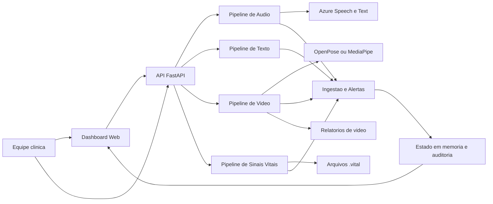

# Arquitetura - Visao Geral

```mermaid
flowchart LR
    U[Equipe clinica] --> W[Dashboard Web]
    U --> A[API FastAPI]
    W --> A

    A --> PA[Pipeline de Audio]
    A --> PT[Pipeline de Texto]
    A --> PV[Pipeline de Video]
    A --> PS[Pipeline de Sinais Vitais]

    PA --> AZ[Azure Speech e Text]
    PV --> OP[OpenPose ou MediaPipe]
    PS --> VF[Arquivos .vital]

    PA --> C[Ingestao e Alertas]
    PT --> C
    PV --> C
    PS --> C

    C --> E[Estado em memoria e auditoria]
    PV --> R[Relatorios de video]
    E --> W
```
